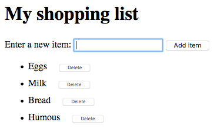

# DOM Manipulation
Learn how to manipulate DOM

## Basic DOM manipulation

To start learning about DOM manipulation, let's begin with a practical example.

1. Take a local copy of the [dom-example.html](./dom-example.html) page and the [image](./image.png) that goes along with it.
2. Add a `<script></script>` element just above the closing `</body>` tag.
3. To manipulate an element inside the DOM, you first need to select it and store a reference to it inside a variable. Inside your script element, add the following line:
     
```javascript
const link = document.querySelector('a');
```

4. Now we have the element reference stored in a variable, we can start to manipulate it using properties and methods available to it (these are defined on interfaces like HTMLAnchorElement in the case of `<a>` element, its more general parent interface HTMLElement, and Node — which represents all nodes in a DOM). First of all, let's change the text inside the link by updating the value of the Node.textContent property. Add the following line below the previous one:

```javascript
link.textContent = 'Mozilla Developer Network';
```
  
5. We should also change the URL the link is pointing to, so that it doesn't go to the wrong place when it is clicked on. Add the following line, again at the bottom:

```javascript
link.href = 'https://developer.mozilla.org';
```

Note that, as with many things in JavaScript, there are many ways to select an element and store a reference to it in a variable. *Document.querySelector()* is the recommended modern approach, which is convenient because it allows you to select elements using CSS selectors. 

The above *querySelector()* call will match the first <a> element that appears in the document. If you wanted to match and do things to multiple elements, you could use *Document.querySelectorAll()*, which matches every element in the document that matches the selector, and stores references to them in an array-like object called a NodeList.

There are older methods available for grabbing element references, such as:

Document.getElementById(), which selects an element with a given id attribute value, e.g. `<p id="myId">My paragraph</p>`. The ID is passed to the function as a parameter, i.e. `const elementRef = document.getElementById('myId')`.

*Document.getElementsByTagName()*, which returns an array-like object containing all the elements on the page of a given type, for example `<p>`s, `<a>`s, etc. The element type is passed to the function as a parameter, i.e. `const elementRefArray = document.getElementsByTagName('p')`.
These two work in older browsers than the modern methods like *querySelector()*, but are not as convenient. Have a look and see what others you can find!

### Creating and placing new nodes

The above has given you a little taste of what you can do, but let's go further and look at how we can create new elements.

Going back to the current example, let's start by grabbing a reference to our `<section>` element — add the following code at the bottom of your existing script (do the same with the other lines too):

```javascript
const sect = document.querySelector('section');
```

Now let's create a new paragraph using Document.createElement() and give it some text content in the same way as before:

```javascript
const para = document.createElement('p');
para.textContent = 'We hope you enjoyed the ride.';
```

You can now append the new paragraph at the end of the section using Node.appendChild():

```javascript
sect.appendChild(para);
```

Finally for this part, let's add a text node to the paragraph the link sits inside, to round off the sentence nicely. First we will create the text node using Document.createTextNode():

```javascript
const text = document.createTextNode(' — the premier source for web development knowledge.');
```

Now we'll grab a reference to the paragraph the link is inside, and append the text node to it:

```javascript
const linkPara = document.querySelector('p');
linkPara.appendChild(text);
```

That's most of what you need for adding nodes to the DOM — you'll make a lot of use of these methods when building dynamic interfaces (we'll look at some examples later).

### Moving and removing elements

There may be times when you want to move nodes, or delete them from the DOM altogether. This is perfectly possible.

If we wanted to move the paragraph with the link inside it to the bottom of the section, we could simply do this:

```javascript
sect.appendChild(linkPara);
```

This moves the paragraph down to the bottom of the section. You might have thought it would make a second copy of it, but this is not the case — linkPara is a reference to the one and only copy of that paragraph. If you wanted to make a copy and add that as well, you'd need to use *Node.cloneNode()* instead.

Removing a node is pretty simple as well, at least when you have a reference to the node to be removed and its parent. In our current case, we just use *Node.removeChild()*, like this:

```javascript
sect.removeChild(linkPara);
```

When you want to remove a node based only on a reference to itself, which is fairly common, you can use ChildNode.remove():

```javascript
linkPara.remove();
```

This method is not supported in older browsers. They have no method to tell a node to remove itself, so you'd have to do the following.

```javascript
linkPara.parentNode.removeChild(linkPara);
```

Have a go at adding the above lines to your code.

Manipulating styles
It is possible to manipulate CSS styles via JavaScript in a variety of ways.

To start with, you can get a list of all the stylesheets attached to a document using Document.stylesheets, which returns an array-like object with CSSStyleSheet objects. You can then add/remove styles as wished. However, we're not going to expand on those features because they are a somewhat archaic and difficult way to manipulate style. There are much easier ways.

The first way is to add inline styles directly onto elements you want to dynamically style. This is done with the HTMLElement.style property, which contains inline styling information for each element in the document. You can set properties of this object to directly update element styles.

As an example, try adding these lines to our ongoing example:

```javascript
para.style.color = 'white';
para.style.backgroundColor = 'black';
para.style.padding = '10px';
para.style.width = '250px';
para.style.textAlign = 'center';
```

Reload the page and you'll see that the styles have been applied to the paragraph. If you look at that paragraph in your browser's Page Inspector/DOM inspector, you'll see that these lines are indeed adding inline styles to the document:

```javascript
<p style="color: white; background-color: black; padding: 10px; width: 250px; text-align: center;">We hope you enjoyed the ride.</p>
```

Note: Notice how the JavaScript property versions of the CSS styles are written in lower camel case whereas the CSS versions are hyphenated (e.g. backgroundColor versus background-color). Make sure you don't get these mixed up, otherwise it won't work.

There is another common way to dynamically manipulate styles on your document, which we'll look at now.

Delete the previous five lines you added to the JavaScript.
Add the following inside your HTML `<head>`:

```javascript
<style>
.highlight {
  color: white;
  background-color: black;
  padding: 10px;
  width: 250px;
  text-align: center;
}
</style>
```

Now we'll turn to a very useful method for general HTML manipulation — Element.setAttribute() — this takes two arguments, the attribute you want to set on the element, and the value you want to set it to. In this case we will set a class name of highlight on our paragraph:

```javascript
para.setAttribute('class', 'highlight');
```

Refresh your page, and you'll see no change — the CSS is still applied to the paragraph, but this time by giving it a class that is selected by our CSS rule, not as inline CSS styles.
Which method you choose is up to you; both have their advantages and disadvantages. The first method takes less setup and is good for simple uses, whereas the second method is more purist (no mixing CSS and JavaScript, no inline styles, which are seen as a bad practice). As you start building larger and more involved apps, you will probably start using the second method more, but it is really up to you.

At this point, we haven't really done anything useful! There is no point using JavaScript to create static content — you might as well just write it into your HTML and not use JavaScript. It is more complex than HTML, and creating your content with JavaScript also has other issues attached to it (such as not being readable by search engines).


## A dynamic shopping list

To round off the article, we'd like to set you a little challenge — we want to make a simple shopping list example that allows you to dynamically add items to the list using a form input and button. When you add an item to the input and press the button:

* The item should appear in the list.
* Each item should be given a button that can be pressed to delete that item off the list.
* The input should be emptied and focused ready for you to enter another item.

The finished demo will look something like this:



To complete the exercise, follow the steps below, and make sure that the list behaves as described above.

1. To start with, download a copy of our [shopping-list.html](./shopping-list.html) starting file and make a copy of it somewhere. You'll see that it has some minimal CSS, a list with a label, input, and button, and an empty list and <script> element. You'll be making all your additions inside the script.

2. Create three variables that hold references to the list (`<ul>`), `<input>`, and `<button>` elements.

3. Create a function that will run in response to the button being clicked.

4. Inside the function body, start off by storing the current value of the input element in a variable.

5. Next, empty the input element by setting its value to an empty string — `''`.

6. Create three new elements — a list item (`<li>`), `<span>`, and `<button>`, and store them in variables.

7. Append the span and the button as children of the list item.

8. Set the text content of the span to the input element value you saved earlier, and the text content of the button to 'Delete'.

9. Append the list item as a child of the list.

10. Attach an event handler to the delete button, so that when clicked it will delete the entire list item it is inside.

11. Finally, use the `focus()` method to focus the input element ready for entering the next shopping list item.
